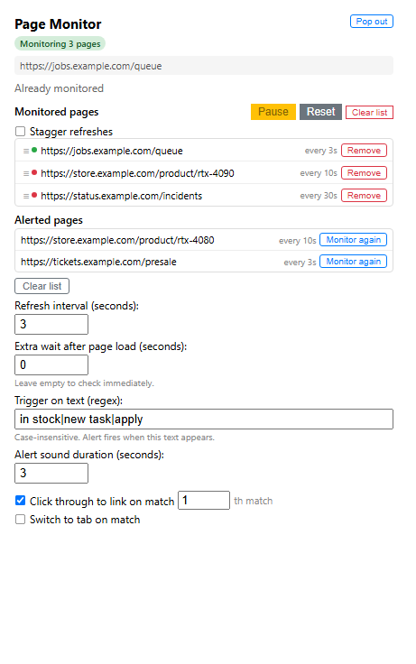
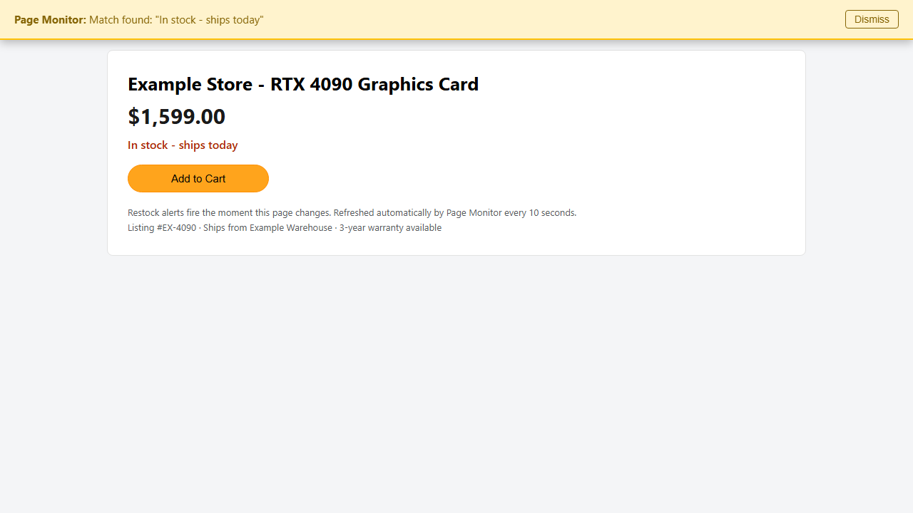

# Page Monitor

A Chrome extension that auto-refreshes any web page and alerts you with a banner and
sound the moment your trigger text appears. Monitor several tabs or whole sites at
once, with settings that persist across browser restarts.

*Three pages watched side by side; triggered entries move to **Alerted pages** for
one-click re-arming.*

## Why

Some pages only tell you what you need by *changing*: a job board posting new tasks,
a store flipping to in-stock, a dashboard finally rendering results. Page Monitor
watches those pages for you and makes noise when it matters, so you can stop hitting
F5.

When a page matches, you get a banner and a beep right on that page:

## Trigger ideas

Triggers are case-insensitive regexes matched against the page's visible text. Plain
keywords are usually all you need; separate alternatives with a pipe, and the monitor
fires when any of them appears. For example, `price drop | back in stock` fires when
the page contains either phrase:

`in stock | new task | price drop | cancellation | registration opens`

Numbers are where regex pays off. Anchor on the currency sign and tune the leading
digits:

| Goal | Trigger | Catches |
|---|---|---|
| Price under $500 | `\$(?:[1-4]\d\d)\.\d{2}` | any price from $100.00 to $499.99 |
| Price between $150 and $299 | `\$(?:1[5-9]\|2\d\d)\.\d{2}` | prices in that range |
| Airfare under $300 | `\$(?:[12]\d\d)\.\d{2}` | fares under $300; add a keyword like `fare` (i.e. `|fare`) |

## Features

- **Auto-refresh** any page on a fixed interval. Scheduling uses `chrome.alarms`, so
  monitors keep working even when Chrome throttles background work (Manifest V3).
- **Regex triggers**, case-insensitive, matched against visible page text. Optional
  extra wait after load for slow-rendering content.
- **On match**: yellow banner injected into the page, plus a repeating beep whose
  duration you control.
- **Click-through**: open the Nth link containing the match in a new tab.
- **Switch to tab**: focus the monitored tab the moment it triggers.
- **Multiple monitors**: run many pages side by side, with staggered refresh offsets
  so they never fire at the same instant.
- **Alerted pages list**: triggered entries move here; re-arm one later with its
  original position and settings.
- **Pause and resume everything**, drag-and-drop reorder, bulk interval reset, and
  full persistence across restarts.
- **Zero dependencies**: vanilla JavaScript on Chrome Manifest V3 (`alarms`,
  `storage`, `offscreen`, `windows`).

## Install

1. Download or clone this repository.
2. Open `chrome://extensions` in Chrome, Edge, or any Chromium-based browser.
3. Enable **Developer mode** (top-right toggle).
4. Click **Load unpacked** and select this folder.

## Usage

1. Open the page you want watched.
2. Click the Page Monitor icon, tune the fields if needed, then **Add this page**.
   - *Refresh interval*: seconds between reloads
   - *Trigger on text*: case-insensitive regex, e.g. `in stock` or `price.*\$49`
   - *Extra wait*: seconds to sit on the freshly loaded page before checking
   - *Click through* / *Switch to tab*: optional reactions on match
3. To watch several pages at once, click **Select tabs** and pick from your open tabs.
4. When a page matches, it stops refreshing, plays the alert, shows a banner, and moves
   to **Alerted pages**. Reopen it anytime from there.

## How it works

A [content script](content.js) waits out your load delay, reads
`document.body.innerText`, and tests it against your regex. The
[background service worker](background.js) schedules each monitor as its own alarm
(optionally staggered across entries), reloads the tab, and relays results. Matches
fire a banner in the page and a beep synthesized via WebAudio, with an
[offscreen document](offscreen.js) fallback so audio plays even without a visible tab.
All monitors, settings, and alerted history persist in `chrome.storage.local`.

## Tech

Vanilla JavaScript on Chrome Extension Manifest V3. No build step, no dependencies.
